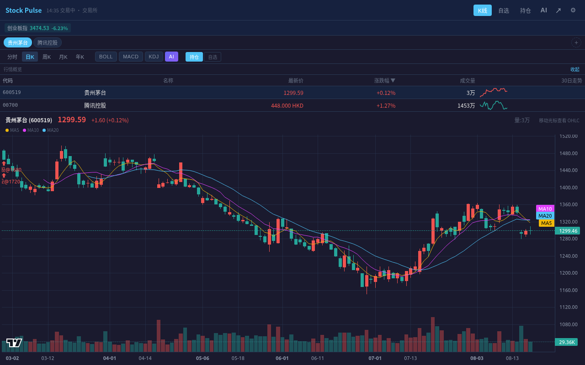
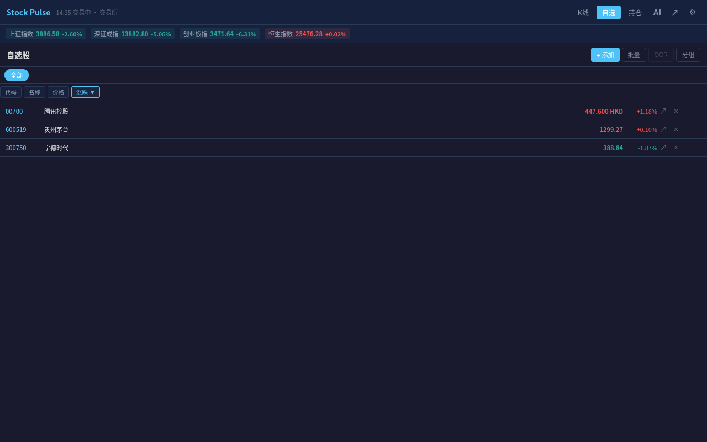
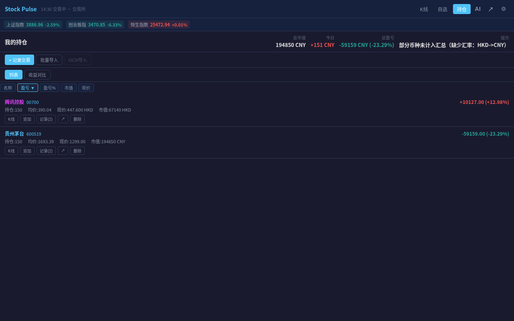
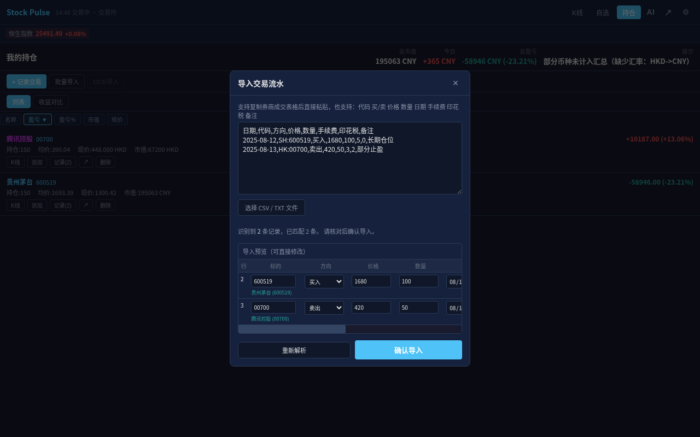
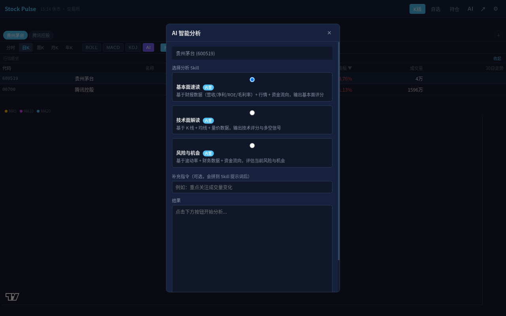
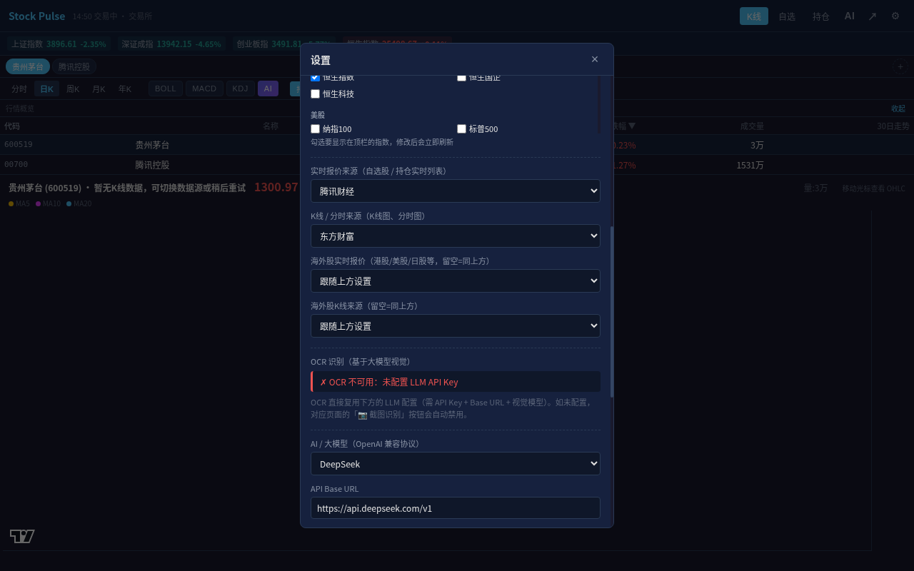

# Stock Pulse — K 线行情与持仓助手


Stock Pulse 是一款运行在 Chrome Side Panel 中的本地优先股票工具，覆盖 A 股、港股、美股等市场以及主流加密资产。它把实时行情、K 线、自选股、交易流水、实际持仓收益、AI 分析和截图 OCR 集成在一个紧凑界面中。

> 本项目用于行情查看和个人研究，不构成投资建议。免费数据源可能受网络、频率限制或服务可用性影响。

## 界面预览

所有图片均为插件实际运行界面，原图位于 [`docs/screenshots`](docs/screenshots)。

| 行情总览与 K 线 | 自选股管理 |
| --- | --- |
|  |  |

| 持仓与盈亏 | 批量交易流水预览 |
| --- | --- |
|  |  |

| AI Skills | 数据源与 AI 设置 |
| --- | --- |
|  |  |

## 功能全景

| 模块 | 主要能力 |
| --- | --- |
| 行情与 K 线 | 分时、日 K、周 K、月 K、年 K；MA5/10/20；BOLL、MACD、KDJ；成交量；买卖点标记 |
| 多标的概览 | 最新价、涨跌幅、成交量、30 日走势，多列排序，失败状态与单项重试 |
| 自选股 | 搜索、批量文本导入、截图 OCR、右键菜单加入、分组、排序、外部行情跳转 |
| 持仓 | 买卖流水、手续费、印花税、持仓成本、市值、当日盈亏、累计盈亏、买卖点展示 |
| 收益对比 | 按真实交易流水计算累计收益，也可切换为纯股价表现；支持隐藏与高亮标的 |
| 批量导入 | CSV、TSV、券商复制文本、带引号字段和多行备注；导入前预览、修改、校验、去重 |
| AI 分析 | 基本面速读、技术面解读、风险与机会 3 个内置 Skill；支持用户自定义 Skill |
| OCR | 使用用户配置的视觉模型识别自选股代码或交易流水截图，结果可编辑后再写入 |
| 多数据源 | 腾讯、东方财富、新浪、Tushare、聚合数据；加密资产使用 Binance/Dex 数据 |
| 个性化与数据 | 暗色/亮色、自定义强调色、交易所时区、汇总币种、安全备份、恢复和本地数据清理 |

## 主要功能

### 行情、K 线与技术指标

- 支持分时、日 K、周 K、月 K、年 K。
- MA5、MA10、MA20 均线和成交量副图。
- BOLL、MACD、KDJ 指标可独立开关。
- 行情概览同时展示多只股票，支持按代码、名称、价格和涨跌幅排序。
- K 线上标记持仓买入、卖出价格和时间。
- 历史 K 线使用缓存，自动刷新只更新实时报价；请求失败时保留上次成功数据。
- 顶部指数条可自定义上证、深证、创业板、恒生、美股等指数，修改后立即生效。

### 自选股

- 搜索股票名称或代码，按 Enter 可直接选择第一条结果。
- 批量粘贴代码、名称或常见市场前后缀。
- 使用 OCR 从截图中提取代码。
- 选中文字后通过浏览器右键菜单加入自选；Side Panel 关闭时也会直接保存。
- 自定义分组和按组筛选。
- 实时报价失败时显示明确状态并支持单项重试。

### 持仓与交易流水

- 记录买入和卖出，支持成交日期、时间、手续费、印花税和备注。
- 自动计算持仓数量、成本、市值、当日盈亏和累计盈亏。
- 阻止无持仓卖出和超持仓卖出。
- 支持 A 股、港股、美股等不同市场数量单位，不强制 100 股步长。
- CSV/TSV/文本批量导入会先生成可编辑预览。
- 整批交易会先完成校验再一次性写入，任意一条错误都不会产生“导入一半”的数据。
- 重复导入同一份流水会自动跳过已有记录。
- 日期、价格、数量、费用和市场代码均有严格校验。

示例：

```csv
日期,代码,方向,价格,数量,手续费,印花税,备注
2025-08-12,SH:600519,买入,1680,100,5,0,长期仓位
2025-08-13,HK:00700,卖出,420,50,3,2,部分止盈
```

### AI Skills 与 OCR

- 支持 OpenAI 兼容接口，内置 OpenAI、DeepSeek、通义千问、月之暗面、OpenRouter、Gemini 和自定义预设。
- 基本面速读：财务指标、资金流向和公告摘要。
- 技术面解读：K 线、均线、成交量和多空信号。
- 风险与机会：波动、财务和资金面的综合评估。
- 运行 Skill 时自动注入行情、K 线、财务、公告和资金流数据。
- Skill 可导入、导出为 `SKILL.md`，方便在 Claude、ChatGPT、Cursor、Gemini 等工具间复用。
- OCR 只在显式配置支持图片输入的视觉模型后启用，不会把纯文本模型误当成视觉模型。
- OCR 截图会发送给用户选择的视觉模型服务商；请避免上传不希望交给该服务商处理的信息。

### 个性化、备份与隐私

- 支持暗色、亮色主题和自定义强调色。
- 分时横轴、十字光标、交易日期和顶部时间统一支持交易所、本地或自定义 IANA 时区。
- 持仓汇总可选择 CNY、HKD 或 USD；缺少汇率时会明确提示未计入部分。
- 导出备份默认不包含 API Key 和 Token，只有用户明确确认后才会写入备份。
- 导入备份后会重新初始化行情源、AI、主题、定时器和当前页面。
- 支持一键清空插件本地数据，并在执行前二次确认。

## 安装

### 从发布包安装

1. 下载对应版本 ZIP 并解压。
2. 打开 `chrome://extensions/`。
3. 开启右上角“开发者模式”。
4. 点击“加载已解压的扩展程序”，选择解压后的目录。
5. 点击工具栏中的 Stock Pulse 图标打开 Side Panel。

### 从源码安装

```bash
git clone https://github.com/LeeXN/stock-pulse.git
cd stock-pulse
```

然后按上面的开发者模式步骤选择仓库根目录。需要 Chrome 114 或更高版本。

## 常用操作

### 添加自选股

1. 打开“自选”。
2. 点击“添加”，输入名称或代码。
3. 选择搜索结果；也可以使用“批量”或已配置视觉模型后的“OCR”。

### 记录或导入交易

1. 打开“持仓”。
2. 单笔操作选择“记录交易”；批量操作选择“批量导入”。
3. 检查预览中的标的、方向、价格、数量、日期和费用。
4. 点击“确认导入”。若任意记录无效，整批都不会写入。

### 运行 AI 分析

1. 在设置中配置 Base URL、API Key 和对话模型。
2. 在 K 线页选择标的并点击“AI”。
3. 选择 Skill，可追加关注重点，然后运行分析。
4. OCR 还需要单独填写支持图片输入的视觉模型。

## 数据源

实时报价和 K 线数据源可独立选择，海外股还可以单独设置 Provider。

| Provider | 实时报价 | K 线/分时 | 市场 | 凭证 |
| --- | --- | --- | --- | --- |
| 腾讯财经 | 是，支持批量 | 否 | A 股及部分海外股 | 无 |
| 东方财富 | 是 | 是 | A 股、港股、美股等 | 无 |
| 新浪财经 | 是，支持批量 | 是 | A 股、港股、美股等 | 无 |
| Tushare Pro | 是 | 是 | 由账户权限决定 | Token |
| 聚合数据 | 是 | 是 | A 股 | API Key |
| Binance / Dex | 是 | 是 | 加密资产 | 无 |

默认组合为“腾讯报价 + 东方财富 K 线”。部分免费接口存在限流或暂时不可用的情况，可在设置中切换 Provider 后重试。

## v1.2.1 更新摘要

- 修复批量交易导入部分写入、重复导入、无持仓/超持仓卖出和错误市场匹配。
- 修复美股 K 线备用市场代码未执行、海外市场 Provider 降级和年 K 聚合问题。
- 统一 K 线、成交价和实时价的未复权口径。
- 修复右键加入自选在面板关闭时丢失、导入备份后运行时状态未刷新等问题。
- 加强 OCR 视觉模型校验、CSV 引号/换行解析、密钥备份保护和隐私披露。
- 改善窄屏布局、搜索、错误状态、单项重试和设置可用性。

完整内容见 [RELEASE_NOTES_v1.2.1.md](RELEASE_NOTES_v1.2.1.md) 和 [CHANGELOG.md](CHANGELOG.md)。Chrome Web Store 可直接使用的介绍文案与图片清单见 [docs/CHROME_WEB_STORE_LISTING.md](docs/CHROME_WEB_STORE_LISTING.md)。

## 项目结构

```text
stock-pulse/
├── manifest.json
├── panel.html
├── privacy.html
├── css/
│   └── style.css
├── docs/
│   ├── CHROME_WEB_STORE_LISTING.md
│   └── screenshots/
├── js/
│   ├── background.js   # Service Worker、右键菜单、角标、弹窗
│   ├── storage.js      # chrome.storage.local 抽象、备份与恢复
│   ├── time.js         # 交易所时区、日期和时间戳转换
│   ├── api.js          # 多 Provider 行情、K 线和搜索
│   ├── chart.js        # Lightweight Charts 与技术指标
│   ├── portfolio.js    # 交易校验、持仓和盈亏计算
│   ├── ocr.js          # 视觉模型 OCR 与文本流水解析
│   ├── market.js       # 大盘指数
│   ├── llm.js          # OpenAI 兼容模型调用
│   ├── skills.js       # 内置与用户自定义 Skills
│   ├── enrichment.js   # 财务、公告和资金流增强
│   └── app.js          # 页面状态与交互控制器
├── lib/
│   └── lightweight-charts.standalone.js
└── icons/
```

## FAQ

### 点击图标没有反应

确认 Chrome 版本不低于 114，并检查 `chrome://extensions/` 中插件是否已启用。新标签页可能需要再次点击工具栏图标打开 Side Panel。

### K 线、行情或指数暂时不显示

免费接口可能超时、限流或受网络环境影响。插件会保留上次成功的历史 K 线，并为报价失败项提供重试。也可以在设置中切换数据源。

### AI 测试连接提示 `Failed to fetch`

通常是服务商不允许浏览器 CORS 直连。DeepSeek、通义千问、月之暗面、OpenRouter 和 Gemini 通常可直接连接；其他服务可填写用户自备的 CORS 代理 URL。

### OCR 按钮不可用

OCR 需要同时配置 API Key、Base URL 和明确支持图片输入的视觉模型。纯文本模型不会自动回退为视觉模型。

### 备份是否包含 API Key

默认不包含。导出时只有明确选择“包含密钥”，API Key 和 Token 才会写入 JSON 文件。

## 隐私

- 自选、持仓、设置和 Skill 存储在本机 `chrome.storage.local`。
- API Key 和 Token 仅在调用对应服务时发送给用户选择的服务商。
- OCR 截图会发送给用户配置的视觉模型服务商。
- 安全备份默认排除 API Key 和 Token。
- 详细说明见 [privacy.html](privacy.html)。

## 开发验证

```bash
for file in js/*.js; do node --check "$file"; done
node --test js/__tests__/*.test.js
```

## License

MIT
